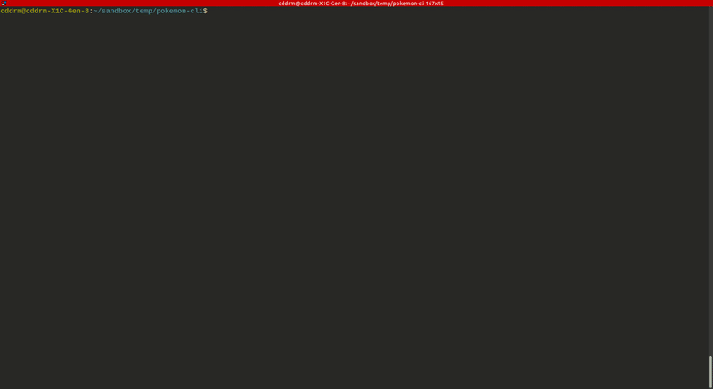

# Pokemon CLI
This is a command line application developed with **Node.js**. It retreives Pokemon information with the API https://pokeapi.co/.



# Requirement
Make sure you have the latest **Node.js** runtime. The version I am using is _v16.13.0_.

# Installation
- Unzip the file to a folder
- Browse to the folder within the terminal and run the following command.

  ```
  npm install
  ```

# Usage
To run the application, type the following command.
```
node app.js
```
1.  Select ID or name for searching
2.  Input the ID or name

# Rules
- The program will look for the local cache to see if the data for the specific id or name already exists.
- If the data already exists, check the saving date to see if it has expired, which means it has been in cache for more than a week.
- If it is either too old or not found in cache, then call the PokeAPI to get the information.
- Save the new data to local cache and print it on the screen as a table.
- The information in the table includes:
  - ID
  - Name
  - Types
  - Encounter locations and methods
  - Stats
  - Date

# Cache
All data will be stored inside the `db` directory as text files. Each pokemon has its own file named with the id. Here is an example of what the text file looks like:

`1.txt`
```json
{
    "id": 1,
    "name": "bulbasaur",
    "types": [
        "grass",
        "poison"
    ],
    "encounterLocations": [
        {
            "location": "cerulean-city-area",
            "methods": [
                "old-rod",
                "good-rod",
                "super-rod",
                "surf"
            ]
        },
        {
            "location": "pallet-town-area",
            "methods": [
                "old-rod",
                "good-rod",
                "super-rod",
                "surf"
            ]
        }
    ],
    "stats": {
        "hp": 45,
        "attack": 49,
        "defense": 49,
        "special-attack": 65,
        "special-defense": 65,
        "speed": 45
    },
    "date": 1637514926407
}
```

There is also a list to maintain all pokemon that have been cached.

`pokemon-list.txt`
```json
  {
    "id": 1,
    "name": "bulbasaur"
  },
  {
    "id": 2,
    "name": "ivysaur"
  },
```

# Code Structure
- **pokemons**: contains the `Pokemon` class and related utilities
- **animations**: contains code for transition animation
- **constants**: stores constants
- **db**: where the cache is located
- **errors**: contains code for hadling errors
- **interactive-cli**: contains code for the command line interaction
- **utils**: contains some utilities, such as functions for making API calls and priting a table

# Potential Improvement
1. Provide a function to display the list of Pokemon in cache.
2. Create a infinite loop so that the program will not stop until the user decides to quit.
3. Display the ASCII version of the image for each Pokemon.
4. Provide a function to search the cached Pokemon with thier properties, such locations or a criteria of stats.
5. Re-do the format of the encounter locations so in some case the display will exceed the height of the terminal.
